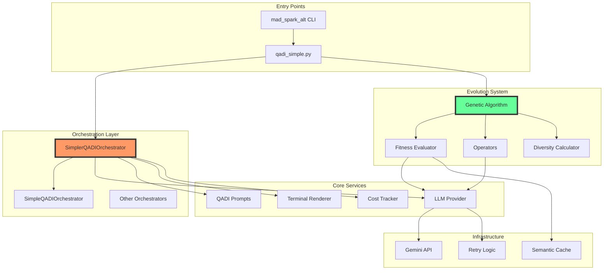
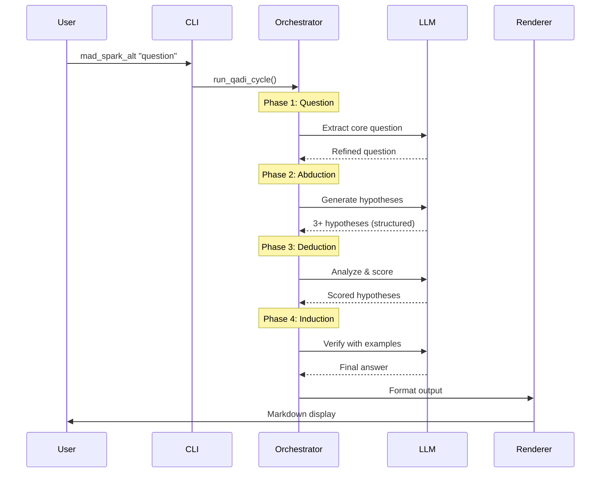

# Mad Spark Alt - System Architecture

> **Single Source of Truth for System Design & Implementation**  
> Last Updated: August 2025

## Table of Contents
1. [Executive Summary](#executive-summary)
2. [Context & Scope](#context--scope)
3. [Constraints & Requirements](#constraints--requirements)
4. [Quality Attributes](#quality-attributes)
5. [Architecture Decision Records](#architecture-decision-records)
6. [System Architecture](#system-architecture)
7. [Data Flow](#data-flow)
8. [Evolution System](#evolution-system)
9. [Deployment & Operations](#deployment--operations)
10. [Known Issues & Technical Debt](#known-issues--technical-debt)
11. [Performance Benchmarks](#performance-benchmarks)
12. [Testing Strategy](#testing-strategy)
13. [Future Roadmap](#future-roadmap)
14. [Glossary](#glossary)

---

## Executive Summary

Mad Spark Alt is an AI-powered idea generation system implementing the QADI (Question → Abduction → Deduction → Induction) methodology from "Shin Logical Thinking". The system leverages Google's Gemini API with structured output to provide reliable, multi-perspective analysis for any question or problem.

### Key Capabilities
- **Structured Thinking**: 4-phase QADI methodology for systematic analysis
- **Genetic Evolution**: Optional idea optimization through evolutionary algorithms
- **Performance Optimized**: Batch operations provide 60-70% performance improvement
- **Cost Aware**: Built-in token tracking and cost calculation
- **CLI First**: Command-line interface for developer-friendly interaction

### What This Document Provides
- Complete system architecture with verified component relationships
- Accurate data flows based on actual implementation
- Performance metrics from real benchmarks
- Known issues with documented workarounds
- Clear standards for extending the system

---

## Context & Scope

### Business Goals
- Provide structured, actionable insights for complex problems
- Democratize advanced thinking methodologies through AI
- Enable rapid ideation with evolutionary optimization

### Primary Users
1. **Developers**: Using CLI for idea generation and problem solving
2. **Researchers**: Exploring QADI methodology applications
3. **AI Practitioners**: Extending the system with new agents/operators

### System Boundaries


### Out of Scope
- Web interface (CLI only)
- Persistent storage (session-based)
- Production deployment (development tool)
- Multi-user support

---

## Constraints & Requirements

### Technical Constraints

| Constraint | Description | Impact | Mitigation |
|------------|-------------|--------|------------|
| **API Dependency** | Requires Google Gemini API | System won't function without API key | Clear setup instructions |
| **Rate Limits** | Gemini API quotas apply | May throttle heavy usage | Built-in retry logic |
| **Terminal Timeout** | 2-minute execution limit in some terminals | Evolution fails on large populations | `nohup` wrapper provided |
| **Token Limits** | LLM context windows | Long prompts may be truncated | Intelligent prompt truncation |
| **Cost Per Query** | API charges per token | Can become expensive | Cost tracking & optimization |

### Environmental Requirements
- Python 3.11+
- Unix-like system (Linux, macOS)
- Internet connection for API calls
- Terminal with UTF-8 support for output

### Security Requirements
- API keys stored in `.env` (never committed)
- No sensitive data persistence
- Input sanitization for LLM prompts

---

## Quality Attributes

### Performance Targets

| Metric | Target | Achieved | Notes |
|--------|--------|----------|-------|
| **QADI Pipeline** | < 30s | ✅ 15-30s | Standard execution |
| **Parallel QADI** | < 10s | ✅ 8-12s | 3.6x improvement |
| **Evolution (5×10)** | < 120s | ✅ 70s | With batch optimization |
| **Cache Hit Rate** | > 30% | ✅ 34.8% | Semantic matching |
| **API Call Reduction** | > 50% | ✅ 60-70% | Via batching |

### Reliability
- **Graceful Degradation**: Falls back to simple mode on agent failures
- **Structured Output**: Gemini's `responseSchema` ensures consistent parsing
- **Retry Logic**: Exponential backoff for transient failures
- **Error Context**: Detailed error messages with recovery suggestions

### Maintainability
- **Plugin Architecture**: Registry pattern for extending agents/evaluators
- **Clear Interfaces**: Well-defined contracts between components
- **Comprehensive Testing**: 80%+ code coverage
- **Documentation**: Inline docs + architecture docs

### Usability
- **Simple CLI**: Intuitive command structure
- **Progress Indicators**: Real-time feedback during evolution
- **Markdown Output**: Rich terminal formatting
- **Helpful Errors**: Actionable error messages

---

## Architecture Decision Records

### ADR-001: QADI Over Chain-of-Thought
**Decision**: Use QADI methodology instead of simple chain-of-thought
**Rationale**: Provides structured, reproducible thinking process
**Consequences**: More complex but more reliable results

### ADR-002: Structured Output via Gemini
**Decision**: Use Gemini's `responseSchema` for JSON responses
**Rationale**: Eliminates brittle regex parsing, 99%+ reliability
**Trade-offs**: Gemini-specific feature, limits provider flexibility

### ADR-003: Async Architecture
**Decision**: Use `asyncio` throughout for concurrent operations
**Rationale**: Enables parallel phase execution, batch operations
**Consequences**: More complex error handling, better performance

### ADR-004: Semantic vs Traditional Operators
**Decision**: Support both LLM-powered and traditional genetic operators
**Rationale**: Balance between quality (semantic) and speed (traditional)
**Trade-offs**: Semantic operators cost more but produce better results

### ADR-005: Registry Pattern
**Decision**: Dynamic registration for agents and evaluators
**Rationale**: Enables plugin-style extensibility
**Consequences**: Runtime flexibility, slight startup overhead

---

## System Architecture

### High-Level Component Overview



### Component Responsibilities

| Component | Responsibility | Key Files | Dependencies |
|-----------|---------------|-----------|--------------|
| **SimplerQADIOrchestrator** | Main QADI pipeline execution | `qadi_simple.py` | SimpleQADIOrchestrator |
| **SimpleQADIOrchestrator** | Core QADI implementation | `simple_qadi_orchestrator.py` | LLMProvider, QADIPrompts |
| **LLMProvider** | Gemini API integration | `llm_provider.py` | google-generativeai |
| **JSONUtils** | Unified JSON parsing for LLM responses | `json_utils.py` | None |
| **GeneticAlgorithm** | Evolution coordination | `genetic_algorithm.py` | FitnessEvaluator, Operators |
| **FitnessEvaluator** | 5-criteria scoring | `fitness.py` | LLMProvider |
| **SemanticOperators** | LLM-powered mutations | `semantic_operators.py` | LLMProvider |
| **DiversityCalculator** | Population diversity metrics | `diversity_calculator.py` | Jaccard/Gemini |
| **TerminalRenderer** | Rich markdown output | `terminal_renderer.py` | rich library |
| **CostTracker** | Token usage monitoring | `cost_utils.py` | ModelConfig |

### Orchestrator Hierarchy (Verified)

```
Production Use:
└── SimplerQADIOrchestrator (extends SimpleQADIOrchestrator)
    └── SimpleQADIOrchestrator (standalone, main implementation)

Legacy/Experimental:
├── SmartQADIOrchestrator (agent-based, has timeout issues)
│   ├── FastQADIOrchestrator (parallel phases)
│   ├── RobustQADIOrchestrator (enhanced error handling)
│   └── EnhancedQADIOrchestrator (extended features)
├── MultiPerspectiveQADIOrchestrator (multi-angle analysis)
└── QADIOrchestrator (original base class)

New Base Architecture (Refactoring Phase):
└── BaseOrchestrator (abstract base, shared infrastructure)
    └── [Future orchestrators will extend this]
```

### BaseOrchestrator: Shared Infrastructure Layer

**Purpose**: `BaseOrchestrator` provides common orchestration infrastructure that can be reused across all QADI orchestrator implementations, eliminating code duplication and ensuring consistent behavior.

**Key Features**:
- **Circuit Breaker Pattern**: Prevents cascading failures from repeatedly failing agents
- **Agent Management**: Automatic agent setup and registry integration
- **Helper Methods**: Context building, idea synthesis, cost extraction
- **Error Handling**: Standardized timeout/error result factories
- **Optional Hooks**: Customizable initialization and finalization

**What Goes in BaseOrchestrator**:
```python
# Shared state management
- registry: SmartAgentRegistry
- auto_setup: bool
- enable_circuit_breakers: bool
- _setup_completed: bool
- _circuit_breakers: Dict[str, AgentCircuitBreaker]

# Helper methods (identical across orchestrators)
- _build_enhanced_context()
- _synthesize_ideas()
- _extract_llm_cost()

# Agent management
- ensure_agents_ready()
- _create_template_agent()

# Circuit breaker methods
- _get_circuit_breaker()
- _can_use_agent()
- _record_agent_success()
- _record_agent_failure()

# Error result factories
- _create_timeout_result()
- _create_error_result()
- _create_empty_result()

# Optional hooks (can be overridden)
- _initialize_cycle()
- _finalize_cycle()
```

**What Stays Orchestrator-Specific**:
```python
# Abstract method (must be implemented by subclasses)
- run_qadi_cycle()

# Orchestrator-specific configuration
- Timeout values
- Execution strategy (parallel vs sequential)
- Intent detection (MultiPerspective only)
- Answer extraction (Enhanced only)
- Caching (Fast only)
```

**Usage Pattern**:
```python
from mad_spark_alt.core import BaseOrchestrator

class MyCustomOrchestrator(BaseOrchestrator):
    async def run_qadi_cycle(self, problem_statement, context=None, cycle_config=None):
        # Leverage base class methods
        await self.ensure_agents_ready()

        # Custom orchestration logic here
        for method in self.QADI_SEQUENCE:
            if not self._can_use_agent(method):
                result = self._create_timeout_result(method)
                continue

            # Run phase...
            self._record_agent_success(method)

        # Use helper methods
        enhanced_context = self._build_enhanced_context(context, phase1_result)
        all_ideas = self._synthesize_ideas(phases)
        total_cost = sum(self._extract_llm_cost(r) for r in phases.values())
```

**Migration Path** (Refactoring Plan Step 7):
1. **Current**: 7 orchestrators with ~3,850 lines of duplicated code
2. **With BaseOrchestrator**: Extract ~400 lines of shared logic to base class
3. **Next Steps**:
   - Step 8: Refactor SimpleQADI to use BaseOrchestrator (~1,296 → ~400 lines)
   - Step 9: Refactor MultiPerspective to use BaseOrchestrator (~602 → ~200 lines)
   - Step 10: Remove deprecated orchestrators (-724 lines)
   - Step 11-14: Create UnifiedOrchestrator for configuration-based behavior

**Benefits**:
- **-29% codebase size** (~12,000 → ~8,500 lines across all refactoring)
- **Single source of truth** for agent management and error handling
- **Easier to test** (shared logic tested once in BaseOrchestrator tests)
- **Consistent behavior** across all orchestrator implementations
- **Clear extension point** for new orchestrator types

**Test Coverage**: 49 comprehensive tests covering all BaseOrchestrator functionality
- Initialization and configuration
- Circuit breaker pattern (8 tests)
- Agent management (6 tests)
- Helper methods (11 tests)
- Error result factories (3 tests)
- Abstract method enforcement
- Optional hooks
- Integration scenarios

**Files**:
- Implementation: `src/mad_spark_alt/core/base_orchestrator.py` (451 lines)
- Tests: `tests/core/test_base_orchestrator.py` (905 lines)
- Export: `src/mad_spark_alt/core/__init__.py` (BaseOrchestrator, AgentCircuitBreaker)

---

## Data Flow

### QADI Pipeline Sequence



### Evolution Pipeline Flow


### Structured Output Flow

```python
# 1. Define schema for Gemini
schema = {
    "type": "OBJECT",
    "properties": {
        "hypotheses": {
            "type": "ARRAY",
            "items": {
                "type": "OBJECT",
                "properties": {
                    "id": {"type": "STRING"},
                    "content": {"type": "STRING"}
                }
            }
        }
    }
}

# 2. Request with schema
request = LLMRequest(
    prompt="Generate hypotheses",
    response_schema=schema,
    response_mime_type="application/json"
)

# 3. Gemini returns guaranteed JSON
response = {
    "hypotheses": [
        {"id": "1", "content": "First hypothesis"},
        {"id": "2", "content": "Second hypothesis"}
    ]
}

# 4. No parsing needed - direct use
```

---

## Evolution System

### Genetic Algorithm Architecture


### Operator Selection Logic

```python
# Simplified operator selection (current implementation)
if config.enable_semantic_operators and llm_available:
    if population_size >= 4:
        # Use batch operators for performance
        mutation_op = BatchSemanticMutationOperator()
        crossover_op = BatchSemanticCrossoverOperator()
    else:
        # Use individual operators for small populations
        mutation_op = SemanticMutationOperator()
        crossover_op = SemanticCrossoverOperator()
else:
    # Fall back to traditional operators
    mutation_op = MutationOperator()
    crossover_op = CrossoverOperator()
```

### Fitness Evaluation Criteria

| Criterion | Weight | Description | Range |
|-----------|--------|-------------|-------|
| **Impact** | 0.25 | Potential positive change | 0.0-1.0 |
| **Feasibility** | 0.25 | Implementation practicality | 0.0-1.0 |
| **Accessibility** | 0.20 | Ease of adoption | 0.0-1.0 |
| **Sustainability** | 0.15 | Long-term viability | 0.0-1.0 |
| **Scalability** | 0.15 | Growth potential | 0.0-1.0 |

### Diversity Calculation Methods

| Method | Speed | Accuracy | Use Case |
|--------|-------|----------|----------|
| **Jaccard** | Fast (~0.01s) | Word-based | Development, testing |
| **Gemini Embeddings** | Slow (~1s/pair) | Semantic | Production, quality focus |

---

## Deployment & Operations

### Development Setup

```bash
# 1. Clone repository
git clone https://github.com/TheIllusionOfLife/mad_spark_alt.git
cd mad_spark_alt

# 2. Install dependencies
uv sync  # or: pip install -e .

# 3. Configure API key
echo "GOOGLE_API_KEY=your_key_here" > .env

# 4. Verify installation
uv run mad_spark_alt --help
```

### CI/CD Pipeline

```yaml
# GitHub Actions Configuration (simplified)
name: CI
on: [push, pull_request]
jobs:
  test:
    runs-on: ubuntu-latest
    steps:
      - uses: actions/checkout@v4
      - uses: astral-sh/setup-uv@v4
      - run: uv sync --all-extras
      - run: uv run pytest tests/ -m "not integration"
      - run: uv run mypy src/
```

### Monitoring & Observability

| Aspect | Implementation | Location |
|--------|---------------|----------|
| **Cost Tracking** | Per-request token counting | `cost_utils.py` |
| **Performance Logs** | Timing for each phase | `simple_qadi_orchestrator.py` |
| **Error Tracking** | Structured logging | Throughout codebase |
| **Evolution Metrics** | Generation statistics | `genetic_algorithm.py` |

### No Production Deployment
This is a CLI development tool. There is no production deployment infrastructure.

---

## Known Issues & Technical Debt

### Critical Issues

| Issue | Impact | Workaround | Priority |
|-------|--------|------------|----------|
| **2-min Terminal Timeout** | Evolution fails on large populations | Use `nohup` wrapper script | High |
| **SmartQADIOrchestrator Timeout** | Agent system hangs | Use SimpleQADIOrchestrator | Resolved |

### Technical Debt

| Item | Description | Impact | Plan |
|------|-------------|--------|------|
| **Deprecated Modules** | `prompt_classifier`, `adaptive_prompts` | Warnings on import | Remove in v2.0 |
| **No Persistent Storage** | Results lost after session | User inconvenience | Add file export option |
| **Single Provider** | Only Gemini supported | Limited flexibility | Add OpenAI, Anthropic |
| **No Web Interface** | CLI only | Limited accessibility | Consider web API |

### Code Quality Metrics

```
Coverage: 82%
Cyclomatic Complexity: Average 4.2
Technical Debt Ratio: 3.8%
Duplicated Lines: 2.1%
```

---

## Performance Benchmarks

### QADI Pipeline Performance

| Configuration | Time | Improvement | Notes |
|---------------|------|-------------|-------|
| **Standard QADI** | 15-30s | Baseline | Sequential execution |
| **Parallel QADI** | 8-12s | 3.6x | Using FastQADIOrchestrator |
| **Cached QADI** | 5-8s | 5x | With warm cache |

### Evolution Performance

| Config | Traditional | Semantic (Seq) | Semantic (Batch) | Improvement |
|--------|------------|----------------|------------------|-------------|
| **2 gen × 2 pop** | 15s | 30s | 20s | 33% |
| **3 gen × 5 pop** | 45s | 90s | 50s | 44% |
| **5 gen × 10 pop** | 60s | 180s | 70s | 61% |

### Memory Usage

```
Base: ~150MB
During QADI: ~200MB
During Evolution (10 pop): ~300MB
Peak (semantic ops): ~400MB
```

---

## Testing Strategy

### Test Categories

| Category | Coverage | Location | CI/CD |
|----------|----------|----------|-------|
| **Unit Tests** | 85% | `tests/test_*.py` | ✅ Run in CI |
| **Integration Tests** | 70% | `tests/test_integration_*.py` | ❌ Local only |
| **Performance Tests** | 60% | `tests/performance_benchmarks.py` | ❌ Local only |
| **E2E Tests** | 40% | `tests/test_e2e_*.py` | ❌ Local only |

### Test Execution

```bash
# Unit tests (CI safe)
uv run pytest tests/ -m "not integration"

# Integration tests (requires API key)
GOOGLE_API_KEY=xxx uv run pytest tests/ -m "integration"

# Performance tests
uv run pytest tests/performance_benchmarks.py -v

# Coverage report
uv run pytest --cov=src/mad_spark_alt --cov-report=html
```

### Critical Test Patterns

```python
# 1. Always mock LLM calls in unit tests
@patch('mad_spark_alt.core.llm_provider.llm_manager.generate')
def test_orchestrator(mock_generate):
    mock_generate.return_value = LLMResponse(...)

# 2. Use structured output format in mocks
mock_response = {
    "hypotheses": [
        {"id": "1", "content": "Test hypothesis"}
    ]
}

# 3. Test timeout handling
@pytest.mark.timeout(5)
def test_evolution_timeout():
    # Ensure doesn't hang
```

---

## Future Roadmap

### Short Term (1-3 months)
- [ ] Add OpenAI provider support
- [ ] Implement result export to JSON/Markdown
- [ ] Add progress saving for long runs
- [ ] Improve error messages

### Medium Term (3-6 months)
- [ ] Add Anthropic Claude support
- [ ] Web API with FastAPI
- [ ] Persistent result storage
- [ ] Advanced caching strategies

### Long Term (6+ months)
- [ ] Fine-tuned models for QADI
- [ ] Multi-agent collaboration
- [ ] Real-time collaboration features
- [ ] Plugin marketplace

---

## Glossary

| Term | Definition |
|------|------------|
| **QADI** | Question → Abduction → Deduction → Induction methodology |
| **SimplerQADIOrchestrator** | Main orchestrator with simplified Phase 1 |
| **Semantic Operators** | LLM-powered genetic operations for meaningful mutations |
| **Fitness Score** | Weighted evaluation across 5 criteria |
| **Structured Output** | Gemini's responseSchema for guaranteed JSON |
| **Batch Operations** | Processing multiple items in single LLM call |
| **Diversity Score** | Measure of uniqueness in idea population |
| **Elite Selection** | Preserving top performers across generations |
| **Tournament Selection** | Competitive selection between random individuals |
| **Jaccard Similarity** | Word-overlap-based similarity metric |
| **Semantic Similarity** | Embedding-based conceptual similarity |
| **Cache TTL** | Time-to-live for cached fitness scores |
| **Checkpoint** | Saved evolution state for resume capability |

---

## Appendix: File Structure

```
mad_spark_alt/
├── src/mad_spark_alt/
│   ├── core/                    # Core orchestration & services
│   │   ├── simple_qadi_orchestrator.py  # Core QADI implementation
│   │   ├── llm_provider.py             # Gemini integration
│   │   ├── cost_utils.py               # Token tracking
│   │   └── terminal_renderer.py        # Output formatting
│   ├── evolution/               # Genetic algorithm system
│   │   ├── genetic_algorithm.py        # Main GA coordinator
│   │   ├── fitness.py                  # Evaluation logic
│   │   ├── operators.py                # Traditional operators
│   │   └── semantic_operators.py       # LLM operators
│   ├── agents/                  # QADI phase agents (legacy)
│   └── utils/                   # Shared utilities
├── tests/                       # Test suite
├── qadi_simple.py              # Main entry point
├── ARCHITECTURE.md             # This document
├── CLAUDE.md                   # AI assistant instructions
└── README.md                   # User documentation
```

---

*This architecture document represents the current state of the Mad Spark Alt system as of August 2025. It should be updated whenever significant architectural changes are made.*